<h3><code>alok@github ~ $ whoami</code></h3>
<table>
  <tr>
    <td valign="top"></td>
    <td valign="top"></td>
  </tr>
</table>

 

<!-- ═══════════════ TYPING ANIMATION ═══════════════ -->

---

## ⚡ Tech Arsenal

**Frontend & Cross-Platform**

**Backend & Data**

**ML & Tools**

---

## 📊 GitHub Stats

&nbsp;&nbsp;

  

---

## 🐍 Contribution Snake

<picture>
  <source media="(prefers-color-scheme: dark)" srcset="https://github.com/alokgorithm/Alokgorithm/blob/output/github-contribution-grid-snake-dark.svg">
  
</picture>

---

  <i>Let's connect and build something amazing together!</i>

  
  &nbsp;
  

